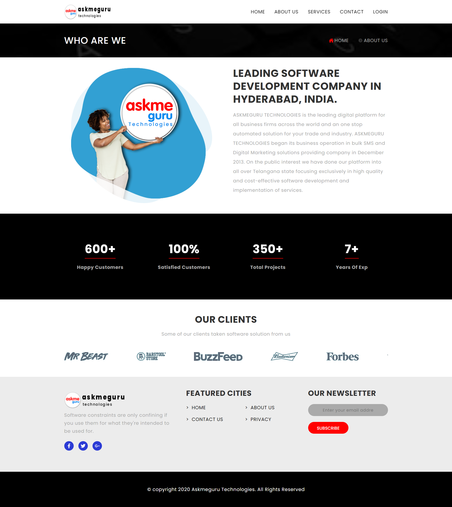
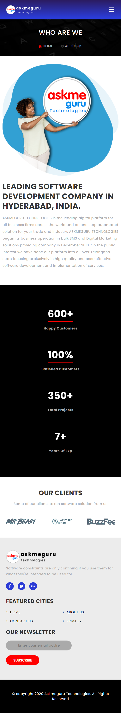

## Project Name: **askmeguru**

## Deployed Link
You can view the live version of the project at: [askmeguru Project](https://ask-me-offers-bhavana.netlify.app/)

## Screenshots
### Desktop View

### Mobile View

## Technologies Used
- **React.js**: A JavaScript library for building user interfaces.
- **CSS**: Cascading Style Sheets for styling the application.
